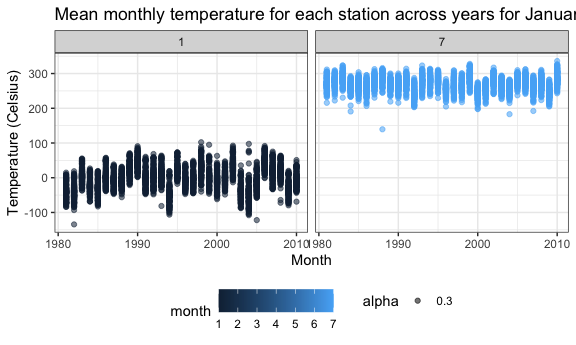
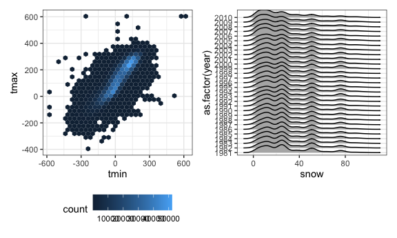
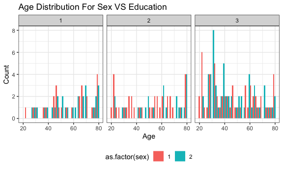
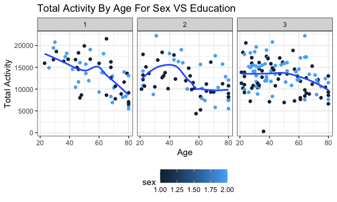
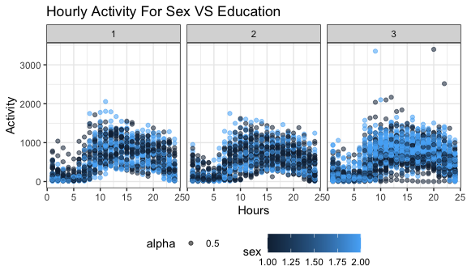

hw3_ryw2109
================
Rita Wang
2024-10-16

### Question 1

``` r
data("ny_noaa") # calling for ny_noaa data
# ny_noaa #displays ny_noaa

nynoaa_df = ny_noaa %>% 
  separate(date, into = c("year", "month", "day"), convert = TRUE) %>% 
    # Create separate variables for year, month, and day
  mutate( # Ensure observations for temperature, precipitation, and snowfall are given in reasonable units
    tmax = as.numeric(tmax),
    tmin = as.numeric(tmin)
    )

nynoaa_df %>% 
  count(snow) %>%
  arrange(desc(n))
```

    ## # A tibble: 282 × 2
    ##     snow       n
    ##    <int>   <int>
    ##  1     0 2008508
    ##  2    NA  381221
    ##  3    25   31022
    ##  4    13   23095
    ##  5    51   18274
    ##  6    76   10173
    ##  7     8    9962
    ##  8     5    9748
    ##  9    38    9197
    ## 10     3    8790
    ## # ℹ 272 more rows

There is a total of 2595176 rows and 9 columns. The following are the
variable names of the dataset:

id, year, month, day, prcp, snow, snwd, tmax, tmin

Reasonable units for maximum and minimum temperature is Celsius, and
reasonable units for precipitation, snowfall, and snowfall depth is mm.
For snowfall, the most commonly observed value is 0 mm to which there
were 2008508 observed data values; this is because snow does not
commonly occur throughout the year.

``` r
# Make a two-panel plot showing the average max temperature in January and in July in each station across years
nynoaa_df %>% 
  group_by(
    id, year, month
    ) %>% 
  filter(
    month %in% c(1, 7) #January and in July
    ) %>% 
  summarize(
    mean_tmax = mean(tmax, na.rm = TRUE) # average max temperature
    ) %>% 
  ggplot(aes(x = year, y = mean_tmax, group = id, color = month)) + 
  geom_point(aes(alpha = 0.3)) + 
  facet_grid(. ~ month) + #two-panel plot 
  labs(
    title = "Mean monthly temperature for each station across years for January and July",
    x = "Month",
    y = "Temperature (Celsius)"
  )
```

    ## `summarise()` has grouped output by 'id', 'year'. You can override using the
    ## `.groups` argument.

    ## Warning: Removed 5970 rows containing missing values or values outside the scale range
    ## (`geom_point()`).



The average maximum temperature in January is much lower than that of
July. There is one outlier in July around 1985 to which the temperature
is slightly colder than the other average maximum temperature in July.

``` r
hex_nynoaa_df = nynoaa_df %>% 
  ggplot(aes (x = tmin , y = tmax) ) + # tmax vs tmin for the full dataset
  geom_hex()

ridges_nynoaa_df = nynoaa_df %>% 
  filter(snow < 100, snow > 0) %>% # snowfall values greater than 0 and less than 100
  ggplot(aes (x = snow , y = as.factor(year))) + # separately by year.
  geom_density_ridges() # distribution

hex_nynoaa_df + ridges_nynoaa_df #two-panel plot
```

    ## Warning: Removed 1136276 rows containing non-finite outside the scale range
    ## (`stat_binhex()`).

    ## Picking joint bandwidth of 3.76



### Question 2

``` r
demograph = read_csv(file = "./data/nhanes_covar.csv", skip = 4) %>%  #import data
    # rows 1-3 had legends
  janitor::clean_names()  #clean column name
```

    ## Rows: 250 Columns: 5
    ## ── Column specification ────────────────────────────────────────────────────────
    ## Delimiter: ","
    ## dbl (5): SEQN, sex, age, BMI, education
    ## 
    ## ℹ Use `spec()` to retrieve the full column specification for this data.
    ## ℹ Specify the column types or set `show_col_types = FALSE` to quiet this message.

``` r
demograph
```

    ## # A tibble: 250 × 5
    ##     seqn   sex   age   bmi education
    ##    <dbl> <dbl> <dbl> <dbl>     <dbl>
    ##  1 62161     1    22  23.3         2
    ##  2 62164     2    44  23.2         3
    ##  3 62169     1    21  20.1         2
    ##  4 62174     1    80  33.9         3
    ##  5 62177     1    51  20.1         2
    ##  6 62178     1    80  28.5         2
    ##  7 62180     1    35  27.9         3
    ##  8 62184     1    26  22.1         2
    ##  9 62186     2    17  22.9        NA
    ## 10 62189     2    30  22.4         3
    ## # ℹ 240 more rows

``` r
accelerometer = read_csv(file = "./data/nhanes_accel.csv") %>%  #import data
  janitor::clean_names()  #clean column name
```

    ## Rows: 250 Columns: 1441
    ## ── Column specification ────────────────────────────────────────────────────────
    ## Delimiter: ","
    ## dbl (1441): SEQN, min1, min2, min3, min4, min5, min6, min7, min8, min9, min1...
    ## 
    ## ℹ Use `spec()` to retrieve the full column specification for this data.
    ## ℹ Specify the column types or set `show_col_types = FALSE` to quiet this message.

``` r
accelerometer
```

    ## # A tibble: 250 × 1,441
    ##     seqn  min1  min2  min3  min4   min5   min6  min7   min8    min9  min10
    ##    <dbl> <dbl> <dbl> <dbl> <dbl>  <dbl>  <dbl> <dbl>  <dbl>   <dbl>  <dbl>
    ##  1 62161 1.11  3.12  1.47  0.938 1.60   0.145  2.10  0.509   1.63   1.20  
    ##  2 62164 1.92  1.67  2.38  0.935 2.59   5.22   2.39  4.90    1.97   3.13  
    ##  3 62169 5.85  5.18  4.76  6.48  6.85   7.24   6.12  7.48    5.47   6.49  
    ##  4 62174 5.42  3.48  3.72  3.81  6.85   4.45   0.561 1.61    0.698  2.72  
    ##  5 62177 6.14  8.06  9.99  6.60  4.57   2.78   7.10  7.25   10.1    7.49  
    ##  6 62178 0.167 0.429 0.131 1.20  0.0796 0.0487 0.106 0.0653  0.0564 0.0639
    ##  7 62180 0.039 0     0     0     0.369  0.265  0.506 0.638   0      0.011 
    ##  8 62184 1.55  2.81  3.86  4.76  6.10   7.61   4.74  6.73    5.42   4.24  
    ##  9 62186 3.08  2.54  2.63  2.12  1.14   1.68   2.84  2.72    2.13   2.18  
    ## 10 62189 2.81  0.195 0.163 0     0.144  0.180  0.870 0.214   0      0     
    ## # ℹ 240 more rows
    ## # ℹ 1,430 more variables: min11 <dbl>, min12 <dbl>, min13 <dbl>, min14 <dbl>,
    ## #   min15 <dbl>, min16 <dbl>, min17 <dbl>, min18 <dbl>, min19 <dbl>,
    ## #   min20 <dbl>, min21 <dbl>, min22 <dbl>, min23 <dbl>, min24 <dbl>,
    ## #   min25 <dbl>, min26 <dbl>, min27 <dbl>, min28 <dbl>, min29 <dbl>,
    ## #   min30 <dbl>, min31 <dbl>, min32 <dbl>, min33 <dbl>, min34 <dbl>,
    ## #   min35 <dbl>, min36 <dbl>, min37 <dbl>, min38 <dbl>, min39 <dbl>, …

``` r
demo_accel = left_join(demograph , accelerometer , by = "seqn") %>% 
    mutate ( # encode data with reasonable variable classes
    seqn = as.integer(seqn),
    sex = as.integer(sex),
    age = as.integer(age),
    education = as.integer(education)
  ) %>%
  filter(age >= 21) %>% # excluding participants less than 21 years of age
  drop_na("sex", "age", "bmi") # excluding those with missing demographic data

demo_accel
```

    ## # A tibble: 228 × 1,445
    ##     seqn   sex   age   bmi education  min1   min2   min3  min4   min5   min6
    ##    <int> <int> <int> <dbl>     <int> <dbl>  <dbl>  <dbl> <dbl>  <dbl>  <dbl>
    ##  1 62161     1    22  23.3         2 1.11  3.12   1.47   0.938 1.60   0.145 
    ##  2 62164     2    44  23.2         3 1.92  1.67   2.38   0.935 2.59   5.22  
    ##  3 62169     1    21  20.1         2 5.85  5.18   4.76   6.48  6.85   7.24  
    ##  4 62174     1    80  33.9         3 5.42  3.48   3.72   3.81  6.85   4.45  
    ##  5 62177     1    51  20.1         2 6.14  8.06   9.99   6.60  4.57   2.78  
    ##  6 62178     1    80  28.5         2 0.167 0.429  0.131  1.20  0.0796 0.0487
    ##  7 62180     1    35  27.9         3 0.039 0      0      0     0.369  0.265 
    ##  8 62184     1    26  22.1         2 1.55  2.81   3.86   4.76  6.10   7.61  
    ##  9 62189     2    30  22.4         3 2.81  0.195  0.163  0     0.144  0.180 
    ## 10 62199     1    57  28           3 0.031 0.0359 0.0387 0.079 0.109  0.262 
    ## # ℹ 218 more rows
    ## # ℹ 1,434 more variables: min7 <dbl>, min8 <dbl>, min9 <dbl>, min10 <dbl>,
    ## #   min11 <dbl>, min12 <dbl>, min13 <dbl>, min14 <dbl>, min15 <dbl>,
    ## #   min16 <dbl>, min17 <dbl>, min18 <dbl>, min19 <dbl>, min20 <dbl>,
    ## #   min21 <dbl>, min22 <dbl>, min23 <dbl>, min24 <dbl>, min25 <dbl>,
    ## #   min26 <dbl>, min27 <dbl>, min28 <dbl>, min29 <dbl>, min30 <dbl>,
    ## #   min31 <dbl>, min32 <dbl>, min33 <dbl>, min34 <dbl>, min35 <dbl>, …

After mereging the two datasets, there is now a total of 228 rows and
1445 columns. The following are the variable names of the dataset:

seqn, sex, age, bmi, education, min1, min2, min3, min4, min5, min6,
min7, min8, min9, min10, min11, min12, min13, min14, min15, min16,
min17, min18, min19, min20, min21, min22, min23, min24, min25, min26,
min27, min28, min29, min30, min31, min32, min33, min34, min35, min36,
min37, min38, min39, min40, min41, min42, min43, min44, min45, min46,
min47, min48, min49, min50, min51, min52, min53, min54, min55, min56,
min57, min58, min59, min60, min61, min62, min63, min64, min65, min66,
min67, min68, min69, min70, min71, min72, min73, min74, min75, min76,
min77, min78, min79, min80, min81, min82, min83, min84, min85, min86,
min87, min88, min89, min90, min91, min92, min93, min94, min95, min96,
min97, min98, min99, min100, min101, min102, min103, min104, min105,
min106, min107, min108, min109, min110, min111, min112, min113, min114,
min115, min116, min117, min118, min119, min120, min121, min122, min123,
min124, min125, min126, min127, min128, min129, min130, min131, min132,
min133, min134, min135, min136, min137, min138, min139, min140, min141,
min142, min143, min144, min145, min146, min147, min148, min149, min150,
min151, min152, min153, min154, min155, min156, min157, min158, min159,
min160, min161, min162, min163, min164, min165, min166, min167, min168,
min169, min170, min171, min172, min173, min174, min175, min176, min177,
min178, min179, min180, min181, min182, min183, min184, min185, min186,
min187, min188, min189, min190, min191, min192, min193, min194, min195,
min196, min197, min198, min199, min200, min201, min202, min203, min204,
min205, min206, min207, min208, min209, min210, min211, min212, min213,
min214, min215, min216, min217, min218, min219, min220, min221, min222,
min223, min224, min225, min226, min227, min228, min229, min230, min231,
min232, min233, min234, min235, min236, min237, min238, min239, min240,
min241, min242, min243, min244, min245, min246, min247, min248, min249,
min250, min251, min252, min253, min254, min255, min256, min257, min258,
min259, min260, min261, min262, min263, min264, min265, min266, min267,
min268, min269, min270, min271, min272, min273, min274, min275, min276,
min277, min278, min279, min280, min281, min282, min283, min284, min285,
min286, min287, min288, min289, min290, min291, min292, min293, min294,
min295, min296, min297, min298, min299, min300, min301, min302, min303,
min304, min305, min306, min307, min308, min309, min310, min311, min312,
min313, min314, min315, min316, min317, min318, min319, min320, min321,
min322, min323, min324, min325, min326, min327, min328, min329, min330,
min331, min332, min333, min334, min335, min336, min337, min338, min339,
min340, min341, min342, min343, min344, min345, min346, min347, min348,
min349, min350, min351, min352, min353, min354, min355, min356, min357,
min358, min359, min360, min361, min362, min363, min364, min365, min366,
min367, min368, min369, min370, min371, min372, min373, min374, min375,
min376, min377, min378, min379, min380, min381, min382, min383, min384,
min385, min386, min387, min388, min389, min390, min391, min392, min393,
min394, min395, min396, min397, min398, min399, min400, min401, min402,
min403, min404, min405, min406, min407, min408, min409, min410, min411,
min412, min413, min414, min415, min416, min417, min418, min419, min420,
min421, min422, min423, min424, min425, min426, min427, min428, min429,
min430, min431, min432, min433, min434, min435, min436, min437, min438,
min439, min440, min441, min442, min443, min444, min445, min446, min447,
min448, min449, min450, min451, min452, min453, min454, min455, min456,
min457, min458, min459, min460, min461, min462, min463, min464, min465,
min466, min467, min468, min469, min470, min471, min472, min473, min474,
min475, min476, min477, min478, min479, min480, min481, min482, min483,
min484, min485, min486, min487, min488, min489, min490, min491, min492,
min493, min494, min495, min496, min497, min498, min499, min500, min501,
min502, min503, min504, min505, min506, min507, min508, min509, min510,
min511, min512, min513, min514, min515, min516, min517, min518, min519,
min520, min521, min522, min523, min524, min525, min526, min527, min528,
min529, min530, min531, min532, min533, min534, min535, min536, min537,
min538, min539, min540, min541, min542, min543, min544, min545, min546,
min547, min548, min549, min550, min551, min552, min553, min554, min555,
min556, min557, min558, min559, min560, min561, min562, min563, min564,
min565, min566, min567, min568, min569, min570, min571, min572, min573,
min574, min575, min576, min577, min578, min579, min580, min581, min582,
min583, min584, min585, min586, min587, min588, min589, min590, min591,
min592, min593, min594, min595, min596, min597, min598, min599, min600,
min601, min602, min603, min604, min605, min606, min607, min608, min609,
min610, min611, min612, min613, min614, min615, min616, min617, min618,
min619, min620, min621, min622, min623, min624, min625, min626, min627,
min628, min629, min630, min631, min632, min633, min634, min635, min636,
min637, min638, min639, min640, min641, min642, min643, min644, min645,
min646, min647, min648, min649, min650, min651, min652, min653, min654,
min655, min656, min657, min658, min659, min660, min661, min662, min663,
min664, min665, min666, min667, min668, min669, min670, min671, min672,
min673, min674, min675, min676, min677, min678, min679, min680, min681,
min682, min683, min684, min685, min686, min687, min688, min689, min690,
min691, min692, min693, min694, min695, min696, min697, min698, min699,
min700, min701, min702, min703, min704, min705, min706, min707, min708,
min709, min710, min711, min712, min713, min714, min715, min716, min717,
min718, min719, min720, min721, min722, min723, min724, min725, min726,
min727, min728, min729, min730, min731, min732, min733, min734, min735,
min736, min737, min738, min739, min740, min741, min742, min743, min744,
min745, min746, min747, min748, min749, min750, min751, min752, min753,
min754, min755, min756, min757, min758, min759, min760, min761, min762,
min763, min764, min765, min766, min767, min768, min769, min770, min771,
min772, min773, min774, min775, min776, min777, min778, min779, min780,
min781, min782, min783, min784, min785, min786, min787, min788, min789,
min790, min791, min792, min793, min794, min795, min796, min797, min798,
min799, min800, min801, min802, min803, min804, min805, min806, min807,
min808, min809, min810, min811, min812, min813, min814, min815, min816,
min817, min818, min819, min820, min821, min822, min823, min824, min825,
min826, min827, min828, min829, min830, min831, min832, min833, min834,
min835, min836, min837, min838, min839, min840, min841, min842, min843,
min844, min845, min846, min847, min848, min849, min850, min851, min852,
min853, min854, min855, min856, min857, min858, min859, min860, min861,
min862, min863, min864, min865, min866, min867, min868, min869, min870,
min871, min872, min873, min874, min875, min876, min877, min878, min879,
min880, min881, min882, min883, min884, min885, min886, min887, min888,
min889, min890, min891, min892, min893, min894, min895, min896, min897,
min898, min899, min900, min901, min902, min903, min904, min905, min906,
min907, min908, min909, min910, min911, min912, min913, min914, min915,
min916, min917, min918, min919, min920, min921, min922, min923, min924,
min925, min926, min927, min928, min929, min930, min931, min932, min933,
min934, min935, min936, min937, min938, min939, min940, min941, min942,
min943, min944, min945, min946, min947, min948, min949, min950, min951,
min952, min953, min954, min955, min956, min957, min958, min959, min960,
min961, min962, min963, min964, min965, min966, min967, min968, min969,
min970, min971, min972, min973, min974, min975, min976, min977, min978,
min979, min980, min981, min982, min983, min984, min985, min986, min987,
min988, min989, min990, min991, min992, min993, min994, min995, min996,
min997, min998, min999, min1000, min1001, min1002, min1003, min1004,
min1005, min1006, min1007, min1008, min1009, min1010, min1011, min1012,
min1013, min1014, min1015, min1016, min1017, min1018, min1019, min1020,
min1021, min1022, min1023, min1024, min1025, min1026, min1027, min1028,
min1029, min1030, min1031, min1032, min1033, min1034, min1035, min1036,
min1037, min1038, min1039, min1040, min1041, min1042, min1043, min1044,
min1045, min1046, min1047, min1048, min1049, min1050, min1051, min1052,
min1053, min1054, min1055, min1056, min1057, min1058, min1059, min1060,
min1061, min1062, min1063, min1064, min1065, min1066, min1067, min1068,
min1069, min1070, min1071, min1072, min1073, min1074, min1075, min1076,
min1077, min1078, min1079, min1080, min1081, min1082, min1083, min1084,
min1085, min1086, min1087, min1088, min1089, min1090, min1091, min1092,
min1093, min1094, min1095, min1096, min1097, min1098, min1099, min1100,
min1101, min1102, min1103, min1104, min1105, min1106, min1107, min1108,
min1109, min1110, min1111, min1112, min1113, min1114, min1115, min1116,
min1117, min1118, min1119, min1120, min1121, min1122, min1123, min1124,
min1125, min1126, min1127, min1128, min1129, min1130, min1131, min1132,
min1133, min1134, min1135, min1136, min1137, min1138, min1139, min1140,
min1141, min1142, min1143, min1144, min1145, min1146, min1147, min1148,
min1149, min1150, min1151, min1152, min1153, min1154, min1155, min1156,
min1157, min1158, min1159, min1160, min1161, min1162, min1163, min1164,
min1165, min1166, min1167, min1168, min1169, min1170, min1171, min1172,
min1173, min1174, min1175, min1176, min1177, min1178, min1179, min1180,
min1181, min1182, min1183, min1184, min1185, min1186, min1187, min1188,
min1189, min1190, min1191, min1192, min1193, min1194, min1195, min1196,
min1197, min1198, min1199, min1200, min1201, min1202, min1203, min1204,
min1205, min1206, min1207, min1208, min1209, min1210, min1211, min1212,
min1213, min1214, min1215, min1216, min1217, min1218, min1219, min1220,
min1221, min1222, min1223, min1224, min1225, min1226, min1227, min1228,
min1229, min1230, min1231, min1232, min1233, min1234, min1235, min1236,
min1237, min1238, min1239, min1240, min1241, min1242, min1243, min1244,
min1245, min1246, min1247, min1248, min1249, min1250, min1251, min1252,
min1253, min1254, min1255, min1256, min1257, min1258, min1259, min1260,
min1261, min1262, min1263, min1264, min1265, min1266, min1267, min1268,
min1269, min1270, min1271, min1272, min1273, min1274, min1275, min1276,
min1277, min1278, min1279, min1280, min1281, min1282, min1283, min1284,
min1285, min1286, min1287, min1288, min1289, min1290, min1291, min1292,
min1293, min1294, min1295, min1296, min1297, min1298, min1299, min1300,
min1301, min1302, min1303, min1304, min1305, min1306, min1307, min1308,
min1309, min1310, min1311, min1312, min1313, min1314, min1315, min1316,
min1317, min1318, min1319, min1320, min1321, min1322, min1323, min1324,
min1325, min1326, min1327, min1328, min1329, min1330, min1331, min1332,
min1333, min1334, min1335, min1336, min1337, min1338, min1339, min1340,
min1341, min1342, min1343, min1344, min1345, min1346, min1347, min1348,
min1349, min1350, min1351, min1352, min1353, min1354, min1355, min1356,
min1357, min1358, min1359, min1360, min1361, min1362, min1363, min1364,
min1365, min1366, min1367, min1368, min1369, min1370, min1371, min1372,
min1373, min1374, min1375, min1376, min1377, min1378, min1379, min1380,
min1381, min1382, min1383, min1384, min1385, min1386, min1387, min1388,
min1389, min1390, min1391, min1392, min1393, min1394, min1395, min1396,
min1397, min1398, min1399, min1400, min1401, min1402, min1403, min1404,
min1405, min1406, min1407, min1408, min1409, min1410, min1411, min1412,
min1413, min1414, min1415, min1416, min1417, min1418, min1419, min1420,
min1421, min1422, min1423, min1424, min1425, min1426, min1427, min1428,
min1429, min1430, min1431, min1432, min1433, min1434, min1435, min1436,
min1437, min1438, min1439, min1440

It can be seen that the original data set had seqn, sex, age, and
education recorded as dbls, however, they are integers.

``` r
# table for the number of men and women in each education category
demo_accel %>% 
  group_by(sex, education) %>% 
  summarize(total_count = n()) %>% 
  pivot_wider(
    names_from = "education",
    values_from = total_count
  ) %>% 
  knitr::kable(digits = 1)
```

    ## `summarise()` has grouped output by 'sex'. You can override using the `.groups`
    ## argument.

| sex |   1 |   2 |   3 |
|----:|----:|----:|----:|
|   1 |  27 |  35 |  56 |
|   2 |  28 |  23 |  59 |

``` r
# age distributions for men and women in each education category
demo_accel %>%
  ggplot(aes(x = age, fill = as.factor(sex))) +
  geom_histogram(position = "dodge") +
  facet_grid(. ~ education) +
  labs(title = "Age Distribution For Sex VS Education",
       x = "Age",
       y = "Count"
  )
```

    ## `stat_bin()` using `bins = 30`. Pick better value with `binwidth`.



Based on the histogram, among those with an education less than high
school, it can be seen there is a larger number of females and males who
are of an older age (60 and above). Based on the table created, there
are 27 males and 28 females who have an education less than high school.

Based on the histogram, among those with an education equivalent to high
school, it can be seen there is a relatively even spread across the
different ages. Based on the table created, there are 35 males and 23
females who have an education if high school equivalent.

Based on the histogram, among those with an education more than high
school, it can be seen there is a larger number of females and males who
are of a younger age (40 and below). Based on the table created, there
are 56 males and 59 females who have an education more than high school.

Across the three histograms, it can be seen that there are more
individuals who have an education more than high school.

``` r
total_demo_accel = demo_accel %>%
  mutate(
    total_activities = rowSums(select(., starts_with("min"))) # sums all the values of min1:min1440 for each participant
  ) %>% 
  select(
    seqn, sex, age, bmi, education, total_activities
    ) 

total_demo_accel %>% 
  ggplot(aes(x = age, y = total_activities, color = sex)) +
  geom_point() +
  geom_smooth(se = FALSE) +
  facet_grid(. ~ education) +
  labs(title = "Total Activity By Age For Sex VS Education",
       x = "Age",
       y = "Total Activity"
  )
```

    ## `geom_smooth()` using method = 'loess' and formula = 'y ~ x'

    ## Warning: The following aesthetics were dropped during statistical transformation:
    ## colour.
    ## ℹ This can happen when ggplot fails to infer the correct grouping structure in
    ##   the data.
    ## ℹ Did you forget to specify a `group` aesthetic or to convert a numerical
    ##   variable into a factor?
    ## The following aesthetics were dropped during statistical transformation:
    ## colour.
    ## ℹ This can happen when ggplot fails to infer the correct grouping structure in
    ##   the data.
    ## ℹ Did you forget to specify a `group` aesthetic or to convert a numerical
    ##   variable into a factor?
    ## The following aesthetics were dropped during statistical transformation:
    ## colour.
    ## ℹ This can happen when ggplot fails to infer the correct grouping structure in
    ##   the data.
    ## ℹ Did you forget to specify a `group` aesthetic or to convert a numerical
    ##   variable into a factor?



From the graphs, we can see that for all 3 educational levels, there is
a general decrease of activity as age increases.

For individuals with an education less than high school, older males had
higher total activity compared to females. Between age 50 to 60, the
originally decreasing total activity with age had an increase.

For individuals with an education equivalent to high school, younger and
older females had higher total activity compared to males. Between age
30 to 40, there seems to be an increase of total activity. At age 40,
the total activity decreased and leveled off starting at age 55.

For individuals with an education higher than high school, older females
had higher total activity compared to males. In general, there is a
general decrease in total activity as age increases.

``` r
long_hour_demo_accel = demo_accel %>%
  select(seqn, sex, age, bmi, education, min1:min1440) %>% 
  mutate( # converting minutes to hours
    hour1 = rowSums(select(., min1:min60)),
    hour2 = rowSums(select(., min61:min120)),
    hour3 = rowSums(select(., min121:min180)),
    hour4 = rowSums(select(., min181:min240)),
    hour5 = rowSums(select(., min241:min300)),
    hour6 = rowSums(select(., min301:min360)),
    hour7 = rowSums(select(., min361:min420)),
    hour8 = rowSums(select(., min421:min480)),
    hour9 = rowSums(select(., min481:min540)),
    hour10 = rowSums(select(., min541:min600)),
    hour11 = rowSums(select(., min601:min660)),
    hour12 = rowSums(select(., min661:min720)),
    hour13 = rowSums(select(., min721:min780)),
    hour14 = rowSums(select(., min781:min840)),
    hour15 = rowSums(select(., min841:min900)),
    hour16 = rowSums(select(., min901:min960)),
    hour17 = rowSums(select(., min961:min1020)),
    hour18 = rowSums(select(., min1021:min1080)),
    hour19 = rowSums(select(., min1081:min1140)),
    hour20 = rowSums(select(., min1141:min1200)),
    hour21 = rowSums(select(., min1201:min1260)),
    hour22 = rowSums(select(., min1261:min1320)),
    hour23 = rowSums(select(., min1321:min1380)),
    hour24 = rowSums(select(., min1381:min1440))
  )

hour_demo_accel = long_hour_demo_accel %>% 
  select(seqn, sex, age, bmi, education, hour1:hour24) %>% 
  pivot_longer( # converts the hour1:hour24 columns into rows
    hour1:hour24,
    names_to = "hr",
    names_prefix = "",
    values_to = "hour_activity"
    ) %>% 
  mutate(
    hr = gsub("hour", "", hr),
    hr = as.integer(hr)
  )

hour_demo_accel %>% 
  ggplot(aes(x = hr, y = hour_activity, color = sex)) +
  geom_point(aes(alpha = 0.5)) +
  facet_grid(. ~ education) +
  labs(title = "Hourly Activity For Sex VS Education",
       x = "Activity",
       y = "Hours"
  )
```



The average activity of a 24 hour time period have a relatively similar
spread of across all 3 education levels, with a low amount of activity
within in the first 5 hours of a day to which the total activity
increases peaking at hour 10-15. Males and females with an education
less than high school have a relatively similar spread of exercise. For
those with an education equivalent to high school, we see that the data
points are darker for each hour, indicating that more males are having
activities than females for a given time period. For those with an
education higher than high school, we see that the data points are more
yellow for each hour, indicating that more females are having activities
than males for a given time period.
