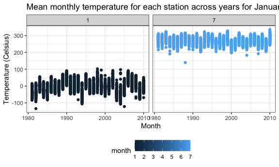

hw3_ryw2109
================
Rita Wang
2024-10-16

### Question 1

``` r
data("ny_noaa") # calling for ny_noaa data
# ny_noaa #displays ny_noaa

nynoaa_df = ny_noaa %>% 
  separate(date, into = c("year", "month", "day"), convert = TRUE) %>% 
    # Create separate variables for year, month, and day
  mutate( # Ensure observations for temperature, precipitation, and snowfall are given in reasonable units
    tmax = as.numeric(tmax),
    tmin = as.numeric(tmin)
    )

nynoaa_df %>% 
  count(snow) %>%
  arrange(desc(n))
```

    ## # A tibble: 282 × 2
    ##     snow       n
    ##    <int>   <int>
    ##  1     0 2008508
    ##  2    NA  381221
    ##  3    25   31022
    ##  4    13   23095
    ##  5    51   18274
    ##  6    76   10173
    ##  7     8    9962
    ##  8     5    9748
    ##  9    38    9197
    ## 10     3    8790
    ## # ℹ 272 more rows

Reasonable units for maximum and minimum temperature is Celsius, and
reasonable units for precipitation, snowfall, and snowfall depth is mm.
For snowfall, the most commonly observed value is 0 mm to which there
were 2008508 observed data values; this is because snow does not
commonly occur throughout the year.

``` r
# Make a two-panel plot showing the average max temperature in January and in July in each station across years
nynoaa_df %>% 
  group_by(
    id, year, month
    ) %>% 
  filter(
    month %in% c(1, 7) #January and in July
    ) %>% 
  summarize(
    mean_tmax = mean(tmax, na.rm = TRUE) # average max temperature
    ) %>% 
  ggplot(aes(x = year, y = mean_tmax, group = id, color = month)) + 
  geom_point() + 
  facet_grid(. ~ month) + #two-panel plot 
  labs(
    title = "Mean monthly temperature for each station across years for January and July",
    x = "Month",
    y = "Temperature (Celsius)"
  )
```

    ## `summarise()` has grouped output by 'id', 'year'. You can override using the
    ## `.groups` argument.

    ## Warning: Removed 5970 rows containing missing values or values outside the scale range
    ## (`geom_point()`).



The average maximum temperature in January is much lower than that of
July. There is one outlier in July around 1985 to which the temperature
is slightly colder than the other average maximum temperature in July.
